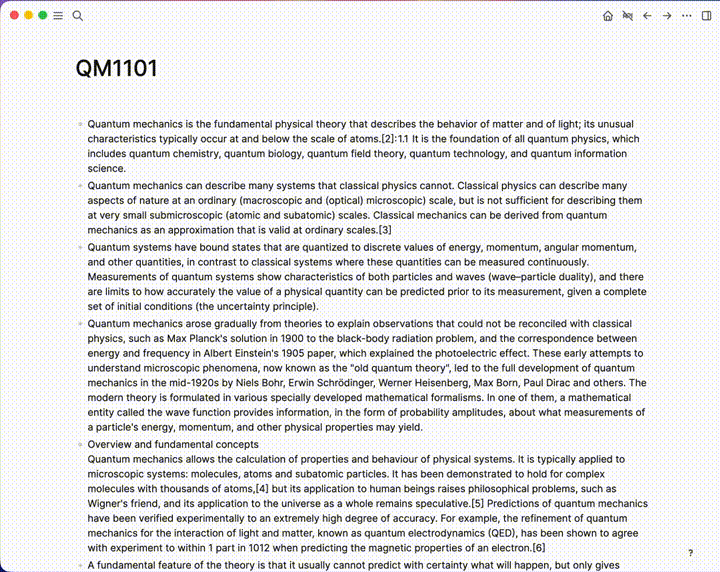

# logseq-nodebuddy-plugin
  

> Your AI NodeBuddy, right inside your graph. Supports cloud and local models, with an opt-in **Wiki Mode** that lets Claude maintain a personal knowledge base for you.

---

## ✨ Features

* **Two modes from a single sidebar:**
  * **Chat Mode** — quick conversations with rich graph context. Every session is saved as a Logseq page you can resume later.
  * **Wiki Mode** — Claude operates your graph as a disciplined knowledge-base maintainer using slash commands and tool-calling. Conversation is ephemeral; only the graph writes persist.
* **Context Injection:** Use `@currentpage`, `@currentweek`, `#tag`, or `[[block reference]]` to pull specific slices of your graph into the prompt.
* **Per-graph custom instructions:** A `CLAUDE.md` page in your graph becomes the system prompt (cached via Anthropic prompt caching on Claude models).
* **Local and cloud models:** Anthropic (API key or OAuth), Google Gemini, plus local Ollama/LM Studio endpoints for Gemma and Qwen.
* **Theming + resizable sidebar:** Drag the left edge to resize; width persists across sessions.

### Context Injection vs MCP
NodeBuddy relies on **Explicit Context Injection** for Chat Mode and **scoped tool-calling** for Wiki Mode — not the general MCP protocol.

* **Context Injection (Chat Mode):** Triggers like `@currentpage`, `[[block reference]]`, or `#tag` deterministically hand specific slices of your graph to the LLM. Fewer hallucinations, no autonomous browsing.
* **Tool-calling (Wiki Mode):** Claude is given a narrow set of read/write tools (`get_page`, `datascript_query`, `create_page`, `insert_batch_blocks`, `upsert_page_property`, etc.). Before any writes, Claude must declare a plan; you approve the **whole plan once**, then the plugin tracks each step and emits an authoritative completion banner when the operation ends.

### Currently supported models
* Anthropic: `claude-opus-4-7`, `claude-opus-4-6`, `claude-sonnet-4-6`, `claude-sonnet-4-5-20250929`, `claude-haiku-4-5-20251001` (any Claude model is required for Wiki Mode)
* Google Gemini: `gemini-2.5-flash`, `gemini-2.5-flash-lite`, `gemini-2.5-flash-pro`, `gemini-3-flash-preview`, `gemini-3-pro-preview`
* Local (Ollama / LM Studio compatible): `gemma2:27b`, `gemma3:27b`, `gemma4:latest`, `qwen3:8b`

## 📸 Screenshots / Demo


## ⚙️ Installation
1. Open Logseq.
2. Go to the **Marketplace** (Plugins > Marketplace).
3. Search for **logseq-nodebuddy**.
4. Click **Install**.

## 🛠 Usage

### Opening the plugin
* Command palette (`Mod+Shift+P`) → `NodeBuddy: Toggle Sidebar`, or
* Keyboard shortcut: `Mod+Shift+N`.

The sidebar opens on the right; drag its left edge to resize.

### Chat Mode
Pick **Start new chat** (or **Name it yourself**, or resume an existing chat) from the home screen.

1. **Page Context** — type `@currentpage` to inject the current page (or zoomed block).
2. **Week Context** — type `@currentweek` to inject all journal pages for the current week.
3. **Tag Context** — type `#meeting`, `#project`, etc. to pull every block carrying that tag.
4. **Block Reference Context** — type `[[John Smith]]` to pull every block linking that page.

Each Chat Mode session creates a Logseq page tagged with your configured session tag (default `NodeBuddy`). Don't manually edit these pages — the plugin uses them to rehydrate conversations on reopen.

### Wiki Mode
Wiki Mode turns NodeBuddy into a maintainer for a personal LLM wiki (Karpathy-style: source pages, concept pages, syntheses, questions, etc.) driven by **your own** `CLAUDE.md` page in the graph.

**Setup:**
1. Create a page titled `CLAUDE.md` in your graph and describe your schema — page types, properties, workflows, hard rules. This page becomes the cached system prompt. Don't skip this — the **Start Wiki Mode** button is disabled until `CLAUDE.md` has content.
2. Select a Claude model in plugin settings (Wiki Mode requires tool-calling).
3. From the home screen, click **Start Wiki Mode**.

**Don't have a `CLAUDE.md` yet?** The schema below is a worked example from one user's personal wiki (`vaulty`) — Karpathy's LLM Wiki pattern adapted to a Logseq DB graph. Paste it into a `CLAUDE.md` page in your graph and adapt the focus areas, page types, and hard rules to your own workflow. The schema is intentionally opinionated; treat it as a starting point, not a template you must keep verbatim.

> **Note on CLI references in the sample.** The sample below is written in terms of the `logseq` CLI (`logseq upsert page …`, `logseq query …`, etc.) because that's the canonical way the schema was authored. Inside this plugin there is no shell — Claude translates every CLI directive into the equivalent tool call (`create_page`, `datascript_query`, `upsert_page_property`, …). You don't need to install the CLI; you can leave the snippets as written and the wiki scaffold prompt will handle the translation.

<details>
<summary><strong>Sample <code>CLAUDE.md</code> (click to expand)</strong></summary>

````markdown
# vaulty — Personal LLM Wiki (Schema)

This file is the **schema layer** of an LLM-maintained personal wiki, in the sense of Karpathy's *LLM Wiki* pattern. The graph `vaulty` is a Logseq DB graph (not a folder of markdown files). This file tells the LLM how to operate as its disciplined maintainer rather than a generic chatbot.

If you are an LLM agent (Claude Code, Codex, etc.) opening this directory: **read this file in full before doing anything else.** The conventions here are non-negotiable.

---

## 1. What this graph is

A personal compounding knowledge base across the user's six focus areas (see §10). Knowledge lives in synthesised wiki pages, not in raw sources. Every ingest updates existing pages where relevant, not just a new source page. Good query answers get filed back as new pages. Nothing important disappears into chat history.

The user curates sources, asks questions, and directs analysis. The LLM does the grunt work — summarising, cross-referencing, filing, and bookkeeping that makes a knowledge base actually useful over time.

## 2. How to operate the graph

You operate the graph exclusively through the `logseq` CLI. Always consult `logseq <command> --help` before running an unfamiliar command — flags change. Use `logseq example <command>` when the command is new to you or when you're about to construct an EDN payload; routine commands don't require it. Do not rely on memorised flags. Use `--output json` only when you need to parse output; otherwise use human output.

The graph data lives in `db.sqlite` in this directory. **There are no markdown files for graph content.** Do not create `.md` files in this directory or anywhere else as a way of writing graph content — write directly to the DB via `logseq upsert page` / `upsert block`.

## 3. One-time setup (already done in this graph)

The following are already in place and should not be recreated:

- Graph: `vaulty` (Logseq DB, schema v65.29, remote+E2EE).
- Type tags: `Source`, `Concept`, `Entity`, `Synthesis`, `Question`.
- Utility tags: `Contradiction`, `Uncertain`, `Orphan`, `Lint`, `Seedling` (the last predates this protocol — see §7a).
- Scaffold pages: `Index`, `Overview`, `Conventions`, `Focus Areas`, `Lint Followups`.
- User properties (with their idents — these are stable and should be reused):
  - `sources` — `:user.property/sources-Hh35PH44` (type `node`, cardinality `many`)
  - `created` — `:user.property/created-TiBbMxyX` (type `date`)
  - `updated` — `:user.property/updated-ccrnVqAO` (type `date`)
  - `source-url` — `:user.property/source-url-qR7eQHJ1` (type `url`)

## 4. Page types

In Logseq DB, "type" is a tag on the page, not a name convention. Every wiki page MUST carry exactly one of:

- `#Source` — one per ingested source. Page name = source title (e.g. `White: The Product Manager`).
- `#Concept` — significant ideas, frameworks, approaches.
- `#Entity` — people, organisations, projects.
- `#Synthesis` — evolving analysis on key questions (most valuable type).
- `#Question` — open threads to investigate.

Apply the type tag with `upsert page --update-tags '["Source"]'` (EDN vector, not comma-separated). **Never** put the type in the page title or as a hashtag inside content — use explicit tag association.

## 5. Page properties

Every wiki page carries these, set via `upsert page --update-properties`:

- `title` (the page name itself)
- `sources` — page references to `#Source` pages this page draws from. **Pass as plain strings in a vector**: `["Karpathy: LLM Wiki" "White: The Product Manager"]`. The `node` property type rejects EDN page-name maps; plain strings work.
- `created` — date (`"YYYY-MM-DD"`)
- `updated` — date; bump on every edit
- `source-url` — on `#Source` pages only, the original URL

Tags are set via `--update-tags`, not as a property.

Cross-references use Logseq's native `[[Page Name]]` syntax inside block content, never markdown file links.

### Example: creating a `#Concept` page

```
logseq upsert page -g vaulty --page "PM as Clarity Creator" \
  --update-tags '["Concept"]' \
  --update-properties '{:user.property/created-TiBbMxyX "2026-05-22"
                         :user.property/updated-ccrnVqAO "2026-05-22"
                         :user.property/sources-Hh35PH44 ["White: The Product Manager"]}'
```

## 6. Session start protocol

At the start of every session:

**a. Confirm graph reachable.**
```
logseq graph info -g vaulty
```

**b. Count pages by type.** Use this canonical Datascript query (substitute each of `Source`, `Concept`, `Entity`, `Synthesis`, `Question`):
```
logseq query -g vaulty --query '[:find (count ?p) :where [?p :block/tags ?t] [?t :block/title "Source"]]'
```
Report all five totals so they're comparable across sessions.

**c. Summarise the last 5 *calendar* days of journal activity** (not the 5 most-recently-edited journals — that misses days you didn't touch and skews recall). Journal pages carry `:block/journal-day` as an integer `YYYYMMDD`. Query the 5 highest values ≤ today, then `logseq show --page "<title>" --level 3` for each. Example:
```
logseq query -g vaulty --query '[:find ?title ?day :where [?p :block/journal-day ?day] [?p :block/title ?title]]'
```
Sort the result by `?day` descending, take the top 5 with `?day ≤ <today as YYYYMMDD>`, then `show` each. Use `logseq show`, not `list page`, for journal content — `show` returns the block tree; `list page` only returns metadata.

If a calendar day in the last 5 has no journal page, say so explicitly — silence on that day is itself a signal.

**d. Report state and ask what to do.** Tell the user the type counts and a one-line summary per journal day, then ask whether they want to **ingest**, **query**, or **lint**.

## 7. Workflow: Ingest

When the user says "ingest [filename or URL]":

a. Read the source in full. For URLs, use WebFetch (handling redirects), or `curl -s` for raw markdown gists.
b. **Surface 3–5 key takeaways for the user's reaction before writing anything to the graph.** Note cross-graph overlaps you spotted while reading. Propose which pages to create or touch.
c. After the user confirms, write directly into the graph: create the `#Source` page with full faithful summary as a block tree (one block per section is usually right), set properties (`created`, `updated`, `source-url`), apply the `#Source` tag.
d. Create any `#Concept`, `#Entity`, or `#Question` pages seeded by the source, each with `sources` pointing at the new `#Source`.
e. Add a one-line entry to `Index` linking the new source and the pages it seeds.
f. Update any related existing pages **only if there's a real connection** — no speculative cross-links.
g. Bump the `updated` property on every page touched.

A single source typically produces 1 `#Source` + 2–5 `#Concept`/`#Question` pages + 1 `Index` block + 0–2 updates to existing hub pages.

## 7a. Workflow: Personal reflections (the user's own thinking)

Distinct from Ingest, which handles **external** sources. This section handles the user's **own** writing — passing reflections, working-through-an-idea notes, finished personal essays.

The wiki compounds when raw thinking gets **promoted** through three stages. Each stage has a different cost and a different commitment level. The job here is to support cheap capture and deliberate promotion — never to force every reflection through a heavyweight page-creation step.

**Stage 1 — Journal blocks (cheap capture).**

A passing thought, a meeting reaction, a half-formed argument goes into today's daily journal as a block. No page creation, no ceremony.

- If the reflection has an obvious wiki anchor → just write `[[Concept]]` references inline. The block surfaces via backreferences on those pages, which is enough.
- If the reflection is nascent, unsure, or has no obvious anchor → tag the block `#Seedling`. Do not force a `[[link]]` you'll regret.
- Both is fine when the reflection touches a known concept but the user wants to mark "I have more to say here later."

**Stage 2 — `#Synthesis` page (deliberate promotion).**

When a Seedling proves load-bearing (it keeps surfacing across days, conversations, or other Seedlings), it gets promoted to a `#Synthesis` page.

- Page title = the **claim or question**, not "My thoughts on X."
- Type tag `#Synthesis`, properties `created` / `updated` / `sources` (may include published sources, other Syntheses, Concepts — or be empty if the source is purely the user's thinking).
- Content is a structured block tree: claim, evidence, what's at stake, how it relates to existing pages, candidate moves, open questions.
- **Do not delete the original journal block.** Edit it to add a single line: `→ Promoted into [[Page Name]]`.
- Bump `#Seedling` off the original block once promoted.

**Stage 3 — `#Concept` page (abstraction).**

When a Synthesis page's argument generalises into a portable idea that recurs across contexts, abstract it into a `#Concept` page. The Synthesis page stays as the domain-specific instantiation; the Concept page is the portable form. Both cite each other.

**Anti-patterns to avoid.**

- ❌ Filing the user's own essays as `#Source` pages. `#Source` is for external sources the user ingested. Their own writing isn't a source to themselves — it's synthesis-in-progress. Use `#Synthesis` instead.
- ❌ Promoting every Seedling. Some fragments aren't ready for months. The "still seedling" outcome is valid; pressuring promotion kills the cheap-capture habit.
- ❌ Self-censoring at capture time. The existence of a review loop (see §9) must not make the user write fewer Seedlings. If lint starts feeling like grading homework rather than sorting a tray, recalibrate — bias toward "leave it" for ambiguous cases.

**Ratio to expect at steady state.** Hundreds of journal blocks → dozens of `#Synthesis` pages → a small number of `#Concept` pages. That funnel is healthy. If every Seedling becomes a Concept, the Concepts dilute. If nothing ever gets promoted, the journal becomes a hoard.

## 8. Workflow: Query

When the user asks a question:

a. Use `logseq query` and `logseq search page` against the graph — read pages, not raw sources.
b. Synthesise with `[[Page Name]]` citations to the pages used.
c. If the answer is substantive, offer to file it as a new `#Synthesis` or `#Question` page, with the cited pages set as its `sources` property.

## 9. Workflow: Lint

A periodic health check using Datascript queries via `logseq query`:

- **Contradictions** — pages/blocks tagged `#Contradiction` not yet resolved.
- **Orphans** — pages with zero inbound references (`:block/_refs` empty).
- **Implicit concepts** — terms mentioned in many blocks but lacking their own page.
- **Stale claims** — pages whose `sources` only include items superseded by newer `#Source` pages.
- **Gaps** — open `#Question` pages a quick web search could close.
- **New questions** — propose new `#Question` pages from threads spotted while sweeping.

For each lint finding requiring follow-up, create a task with `upsert task --status todo --target-page "Lint Followups"` rather than a plain block. **Never** put `TODO`/`DOING`/`DONE` markers in block content — use `--status`.

### 9a. Sub-mode: `lint seedlings`

A separate, deeper pass over `#Seedling` blocks — invoked deliberately ("lint seedlings"), not folded into the standard sweep. Standard lint stays cheap; this sub-mode needs queue depth to be valuable.

What this pass does:

1. Query all `#Seedling` blocks.
2. **Per block:** read the content. Does it now connect to an existing `#Concept` / `#Entity` / `#Source` page that didn't exist or wasn't obvious when the Seedling was written? How old is it?
3. **Across blocks (the highest-value move):** cluster by theme. Three Seedlings circling the same idea = the idea is real, and the recommendation is "write a `#Synthesis` drawing on these three." This clustering is the move you can't do block-by-block; it only works when the whole queue is read at once.

Per cluster (or notable single block), propose one of:
- **Promote** to a `#Synthesis` (most valuable; only when there's real substance).
- **Link** by adding `[[references]]` to existing pages — the connection is now obvious.
- **Merge** Seedlings on the same theme into a single block, or fold them into the new Synthesis.
- **Leave** — the fragment is still incubating, no action needed.

**Posture (critical):** propose, do not autonomously promote. File each recommendation as a task on `Lint Followups` (one task per cluster). The user approves each move; the LLM then executes. Promotion has to be the user's call because they know which fragments are still incubating vs which are ready.

**Bias toward "leave it"** for ambiguous cases. Better to leave a Seedling for another pass than to over-promote and dilute the `#Synthesis` tier.

## 10. Focus areas (priority order)

Mirrored on the `Focus Areas` page.

1. Spirituality
2. Leadership
3. Organisational Development
4. Digital Transformation
5. Social Work
6. Product Management

## 11. Overview page

Maintain the `Overview` page, refreshed after major ingests, with:

- Source count, concept count, entity count, synthesis count, open question count (each via `logseq query`).
- Last lint date.
- Strongest and weakest focus areas (judgement, based on page density per area).

## 12. Hard conventions (do not violate)

- **No markdown files on disk for graph content.** No `/tmp/*.md`, no scratch files, no caching of fetched sources. The Source page itself, with its blocks, is the faithful record. (If you find yourself reaching for `Write` to save a fetched article — stop. Write the Source page instead.)
- **Cross-references**: `[[Page Name]]` inside block content; never `[text](file.md)`.
- **Contradictions**: tag the block `#Contradiction` via `upsert block --update-tags '["Contradiction"]'`, and prefix the block content with ⚠️.
- **Uncertainty**: tag the block `#Uncertain` (do not type `[uncertain]` into content).
- **Always bump the `updated` property** when editing a page.
- **Tag updates always pass an EDN vector** to `--update-tags`, e.g. `'["Concept" "AI-GENERATED"]'` — never a comma-separated string.
- **Quote `--content` values with single quotes** so the shell doesn't interpret backticks or `#`. Inside, escape literal single quotes as `'\''`.
- **Tasks** go through `upsert task --status todo|doing|done`. Never put markers in block content.
- **Do not recreate the type tags or core properties** listed in §3 — they already exist with stable idents.

## 13. Lessons learned in setup sessions

Corrections from earlier sessions, recorded so they're not relearned:

- **`node`-typed properties** (like `sources`) reject EDN page-name maps in `--update-properties`. Pass page names as plain strings in a vector: `["Page Name"]`, not `[[:block/title "Page Name"]]`.
- **Auto-created stub pages** appear when you write `[[Some Page]]` inside a block and that page does not yet exist. These are easy to miss. Surface them in lint passes as candidates for proper `#Concept` treatment.
- **Property idents are stable per graph but unique per property** — the ident contains a random suffix (e.g. `sources-Hh35PH44`). Always look them up with `logseq search property -c "<name>"` rather than guessing.
- **`log.md`** in Karpathy's pattern is replaced by the Logseq daily journal — no separate log page is needed.
- **For broad codebase or graph exploration**, prefer `logseq query` (Datascript) over many small list/show commands.
- **Journal sort order:** `logseq list page --journal-only` defaults to `updated-at` sort, which gives *activity-recent*, not *calendar-recent*. The CLI has no `--sort date` option. For calendar order, query `:block/journal-day` directly (see §6c).
- **`list page` vs `show`:** `list page` is for metadata (titles, timestamps, fields). `show` is for content (block tree). Don't use `list page` when you want to read what's on a page.

## 14. The point of all this

Karpathy: "The tedious part of maintaining a knowledge base is not the reading or the thinking — it's the bookkeeping. Updating cross-references, keeping summaries current, noting when new data contradicts old claims, maintaining consistency across dozens of pages. Humans abandon wikis because the maintenance burden grows faster than the value. LLMs don't get bored, don't forget to update a cross-reference, and can touch 15 files in one pass. The wiki stays maintained because the cost of maintenance is near zero."

Operate accordingly.
````

</details>

**What's different from Chat Mode:**
* The conversation is **state-only** and disappears when the sidebar closes — no Logseq page is created or written for the chat itself.
* The session opens with a greeting bubble listing the available slash commands. The textarea highlights and shows a chip when you type a recognised command (red chip if the command is unknown).
* Slash commands are enabled:

| Command | What it does |
|---|---|
| `/session-start` | Snapshot of your graph: page counts by type and the last 5 calendar days of journal activity. Run it manually whenever you want a fresh snapshot. |
| `/ingest <source>` | Walks the wiki-ingest workflow: summarise → propose pages → on your approval, write the `#Source` page plus seeded `#Concept` / `#Entity` / `#Question` pages and update the `Index`. `<source>` can be: a URL (auto-fetched), `[[Page Name]]` or `page:Some Page` or a page UUID (promotes the existing graph page in place — keeps its title, adds `#Source` tag + properties), `block:<uuid>` (treats a block subtree as source), or pasted text. |
| `/query <question>` | Answers from your graph (not raw sources), citing `[[Page Name]]` references; offers to file substantive answers as `#Synthesis`. |
| `/lint` | Health check — orphans, contradictions, stale claims, implicit concepts; files findings as tasks on `Lint Followups`. |
| `/lint-seedlings` | Deeper pass over `#Seedling` blocks: clusters them by theme and proposes Promote / Link / Merge / Leave for each. |

**Plan-gated approval (the only approval prompt you get):**

1. Before touching the graph, Claude calls `declare_plan(steps)` with the full ordered list of user-visible steps. A **Proposed plan** card appears with **Approve plan** / **Reject** buttons.
2. **Approve plan** unlocks all writes for the rest of the operation — no further prompts. **Reject** sends the rejection back to Claude so it can revise and re-declare (or stop).
3. Each step in the plan checklist updates live (○ pending → ◐ running → ✓ done / ✕ failed / – skipped) as Claude calls `mark_plan_step` after finishing each one.
4. Individual tool calls still appear as collapsible status cards below the plan, so you can see exactly what was attempted — but with no buttons.
5. When the tool-use loop ends, the plugin emits an authoritative **completion banner** generated from the plan state, not from Claude's text: *"Operation complete: 8/8 steps ✅"* or *"Operation finished: 6/8 ✅, 1 ❌, 1 not marked"* with per-step details. You don't have to trust the model's closing summary.

Writes attempted without an approved plan are blocked with an inline "blocked" card and Claude is told to declare a plan first.

### Settings
`Logseq Settings > Plugin Settings > NodeBuddy`:

* **Gemini API Key** — Google Gemini cloud access.
* **Anthropic API Key or OAuth Token** — accepts a standard API key or a Claude Code OAuth token (auto-detected).
* **Local Model Endpoint** — OpenAI-compatible endpoint for Gemma / Qwen (default `http://localhost:1234/v1/chat/completions`).
* **Model** — the active model. Wiki Mode requires a `claude-…` selection.
* **NodeBuddy Page Tag** — tag used to identify Chat Mode session pages (default `NodeBuddy`).
* **Sidebar Width** — pixel width of the sidebar; also adjustable by dragging the left edge.

## ☕️ Support
If you enjoy this plugin, please consider supporting the development.

<div align="center">
  <a href="https://github.com/sponsors/yourusername"></a>&nbsp;<a href="https://www.buymeacoffee.com/yourusername"></a>
</div>

## 🤝 Contributing
Issues are welcome. If you find a bug, please open an issue. Pull requests are not accepted at the moment as I am not able to commit to reviewing them in a timely fashion.
